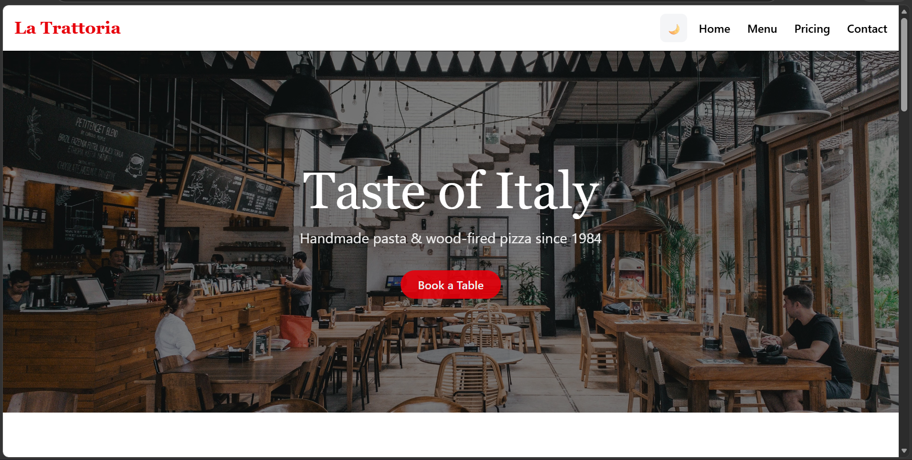
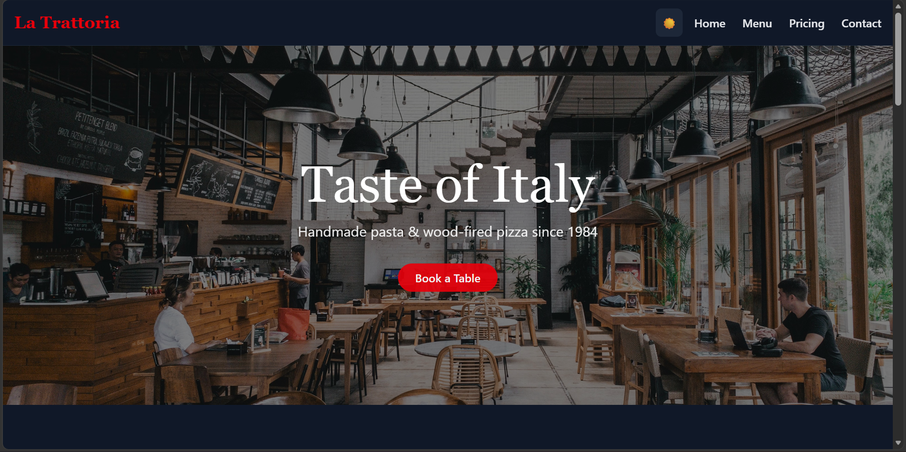

# 🍽️ Restoran Delicia - Landing Page Tailwind CSS

Proyek Landing Page untuk Restoran Delicia menggunakan Vite + Tailwind CSS dengan fitur lengkap yang responsif dan modern.

## 📋 Daftar Fitur yang Telah Diimplementasikan

### ✅ Requirement Terpenuhi:

1. **Project Setup** ✓
   - Vite + Tailwind CSS 4.2.4
   - Build tanpa error
   - Folder `dist/` siap deploy

2. **Tema: Restoran** ✓
   - Berbeda dari pertemuan 4 
   - Desain modern dengan warna orange-red gradient

3. **Section Wajib** ✓
   - **Sticky Navbar**: Hamburger icon di mobile (tanpa JS kompleks, hanya toggle class)
   - **Hero Section**: Hero dengan animasi bounce
   - **Section Menu**: Filter menu (Semua, Appetizer, Main Course, Dessert, Minuman)
   - **Section Produk**: 6 card hidangan dalam grid responsif (1 col mobile, 2 col tablet, 3 col desktop)
   - **Section Testimoni**: 3 testimoni dari pelanggan
   - **Section Newsletter/Kontak**: Form subscribe email
   - **Footer**: Lengkap dengan links dan informasi kontak

4. **Responsive Design** ✓
   - Breakpoint: `sm`, `md`, `lg`
   - Ditest dengan mobile-first approach
   - Grid responsif: 1 col → 2 col (md) → 3 col (lg)

5. **Dark Mode** ✓
   - Toggle button dengan visual indicator (switch)
   - Preferensi disimpan ke `localStorage`
   - Smooth transition dengan duration 300ms
   - Support untuk semua element dengan `dark:` classes

6. **@apply Components** ✓
   - `.btn-primary`: Button utama dengan gradient dan hover effect
   - `.btn-sm`: Button kecil untuk action
   - `.card-product`: Komponen card produk dengan shadow dan scale effect
   - `.menu-btn`: Button filter menu dengan border effect
   - `.card-testimonial`: Komponen testimonial card
   - `.section-title`: Judul section dengan gradient text

7. **Animasi Tailwind + Custom** ✓
   - `animate-fade-in`: Custom animation fade-in on hero section
   - `animate-bounce-slow`: Custom bounce animation di hero emoji
   - `transition-colors`: Smooth color transition untuk dark mode
   - Hover effects: `hover:scale-105`, `hover:shadow-lg`
   - `transform` dan `transition-all` untuk smooth interactions

8. **Build Production** ✓
   ```
   ✓ built in 280ms
   - dist/index.html: 0.47 kB
   - dist/assets/index-*.css: 35.30 kB (gzip: 5.96 kB)
   - dist/assets/index-*.js: 20.48 kB (gzip: 4.28 kB)
   ```

## 📁 Struktur File

```
modul-5/tugas/
├── index.html              # Entry point (diisi oleh main.js)
├── vite.config.js          # Konfigurasi Vite + Tailwind
├── package.json            # Dependencies
├── package-lock.json
├── src/
│   ├── main.js             # Logic utama + HTML structure
│   ├── style.css           # Tailwind + @apply components + animasi
│   ├── counter.js          # (tidak digunakan)
│   └── assets/             # Static files
├── dist/                   # Production build (siap deploy)
│   ├── index.html
│   └── assets/
│       ├── index-*.css
│       └── index-*.js
└── public/
```

## 🚀 Cara Menggunakan

### Development Mode
```bash
npm install
npm run dev
```
Buka browser di `http://localhost:5173`

### Build untuk Production
```bash
npm run build
```
Hasil build ada di folder `dist/`

### Preview Build
```bash
npm run preview
```

## 🎨 Fitur Utama

### Navbar
- Sticky position (tetap di atas saat scroll)
- Menu responsif (desktop + mobile hamburger)
- Dark mode toggle dengan localStorage
- Gradient logo "🍽️ Delicia"

### Hero Section
- Animated emoji (bouncing pizza)
- Gradient background
- Call-to-action button
- Fade-in animation on load

### Produk Section
- 6 hidangan berbeda
- Card dengan hover scale effect
- Shadow effect saat hover
- Harga dan button order
- Grid responsif: 1 → 2 → 3 kolom

### Testimoni
- 3 customer testimonial
- Avatar emoji
- Rating bintang
- Responsive grid

### Newsletter
- Email input form
- Subscribe button
- Gradient background (orange to red)
- Success message handling

### Dark Mode
- Toggle button (switch style)
- Preferensi tersimpan di localStorage
- Smooth transition antar mode
- Support penuh di semua section

## 🛠️ Teknologi yang Digunakan

- **Vite 8.0.10**: Build tool super cepat
- **Tailwind CSS 4.2.4**: Utility-first CSS framework
- **@tailwindcss/vite**: Plugin untuk Vite
- **JavaScript (Vanilla)**: Untuk dark mode dan interaksi

## 📊 Performance

Gzip Size:
- CSS: 5.96 kB
- JS: 4.28 kB
- Total: ~10 kB (sangat ringan!)

## ✨ Animasi & Effects

1. **Fade In** - Hero section muncul saat load
2. **Bounce Slow** - Emoji pizza bouncing di hero
3. **Scale Up** - Product card membesar saat hover
4. **Shadow Increase** - Shadow bertambah saat hover
5. **Color Transition** - Smooth transition saat toggle dark mode
6. **Smooth Scroll** - Scroll smooth saat klik anchor link

## 🎯 Browser Support

- Chrome/Edge (latest)
- Firefox (latest)
- Safari (latest)
- Mobile browsers (iOS Safari, Chrome Mobile)

## 📱 Responsive Breakpoints

- **Mobile**: < 640px (base styles)
- **Tablet**: ≥ 768px (md: prefix)
- **Desktop**: ≥ 1024px (lg: prefix)

## 🔐 Data Privacy

Dark mode preference disimpan di `localStorage` dengan key `darkMode`:
- Value: `'true'` atau `'false'` (string)
- Persisten saat page refresh
- Per browser/device

## 📝 Notes

- Tidak menggunakan external icon library (emoji digunakan untuk simplicity)
- Mobile menu toggle pure CSS + vanilla JS (minimal dependencies)
- Semua animasi menggunakan Tailwind CSS atau CSS murni
- Responsive tested dengan DevTools (mobile, tablet, desktop views)

## 🎓 Learning Outcomes

- Proficiency dengan Tailwind CSS v4
- Implementasi dark mode dengan localStorage
- Responsive design dengan mobile-first approach
- Custom animations dengan Tailwind
- Project structure dengan Vite
- Production build optimization

## ScreenShot
LIGHT MODE


DARK MODE
